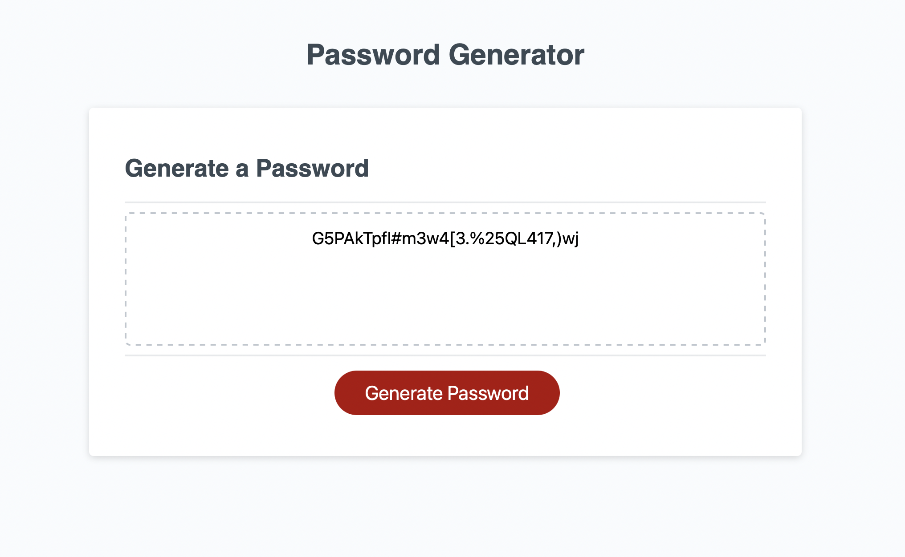

# Password Generator

## Description
Browser based password generator program. The user is prompted to provide the number of characters between 10 - 64 they wish their password to be. Next the user is prompter 4 seperate times about 4 different sets of characters and if they wish to include them in their final password: lowercased characters, uppercased characters, numeric characters and special characters.

When all choices are provided the program grabs the number of random characters user asked for. Then a password is returned into the password field with desired characters in a random order.

## Installation

N/A

## Credits

N/A

## License

Please refer to the LICENSE in the repo.

## Languages used

